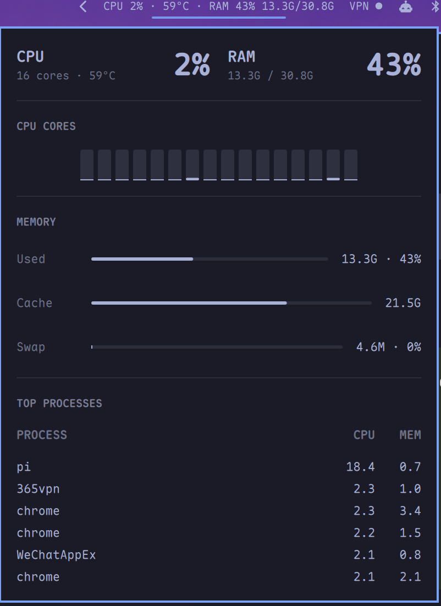

# omarchy-cpu-ram

Live CPU & RAM usage for the [Omarchy](https://omarchy.org/) shell bar, with a
popup that layers per-core bars, a memory breakdown, and the hungriest
processes.



## Features

- **Pure-text bar label** — `CPU 42% · 69°C · RAM 21% 12.6G/30.8G`. No icon
  glyphs, so it stays legible in any monospace font at bar size.
- **State vocabulary** — the label and popup switch from `foreground` to
  `urgent` once CPU %, RAM %, or CPU temperature crosses its alert threshold.
- **Popup panel** (left-click):
  - CPU / RAM heroes: big percentages over a slim capacity bar; the temp
    reading turns urgent on its own once it crosses the threshold
  - justified per-core grid (edge-to-edge, wraps every 16 cores) over a
    hairline baseline, with an `AVG · MAX · LOAD` footer
  - memory breakdown: used / cache / swap
  - top 6 processes by CPU, refreshed while the panel is open
- **Cheap sampling** — a single `cat /proc/stat /proc/meminfo /proc/loadavg`
  per second. CPU usage comes from jiffie deltas, RAM and load averages are
  absolute. The process list is sampled only while the popup is open, so the
  idle cost stays one trivial process per second.
- **CPU temperature** — the package temp (`x86_pkg_temp` thermal zone, with a
  `coretemp` fallback) is discovered by a slow 30s probe, because thermal
  zone numbers shift across boots. No root required.
- **Vertical bars** — collapse to the CPU percent; details live in the tooltip.

## Requirements

- Omarchy with the Quickshell shell (`omarchy-shell`)
- No extra packages, no root

## Install

The plugin is a git repo with a `manifest.json` at its root, so the standard
Omarchy flow works:

```bash
omarchy plugin add https://github.com/forbidden-game/omarchy-cpu-ram.git --enable --yes
```

Or install by hand:

```bash
git clone https://github.com/forbidden-game/omarchy-cpu-ram.git \
  ~/.config/omarchy/plugins/eipi10.cpu-ram
omarchy-shell shell rescanPlugins
omarchy plugin enable eipi10.cpu-ram
```

## Usage

The widget lands in the bar's right section by default. Manage it like any
other bar widget:

```bash
omarchy plugin list                    # see discovered plugins
omarchy plugin enable eipi10.cpu-ram   # enable after install
omarchy plugin disable eipi10.cpu-ram  # remove from the bar
omarchy plugin remove eipi10.cpu-ram --yes   # uninstall completely
omarchy plugin update                  # update all git-managed plugins

omarchy bar move eipi10.cpu-ram --section right   # move between sections
omarchy bar move eipi10.cpu-ram --section left    # or center
```

Removal is clean: the plugin only reads `/proc` and `/sys`, writes nothing
outside its own directory, and needs no sudo rules.

The bar hot-reloads `~/.config/omarchy/shell.json` on save, so settings can
be tuned inline:

```json
{
  "bar": {
    "layout": {
      "right": [
        { "id": "omarchy.tray" },
        { "id": "eipi10.cpu-ram", "showTemp": true, "cpuAlert": 85, "tempAlert": 90 },
        { "id": "omarchy.audio" }
      ]
    }
  }
}
```

### Settings

| Key          | Type   | Default | Description                                |
|--------------|--------|---------|--------------------------------------------|
| `showCpu`    | bool   | `true`  | Show CPU percent on the bar                |
| `showRam`    | bool   | `true`  | Show RAM percent + used/total on the bar   |
| `showTemp`   | bool   | `true`  | Show CPU temperature on the bar            |
| `cpuAlert`   | int    | `85`    | CPU % threshold for the urgent color       |
| `memAlert`   | int    | `90`    | RAM % threshold for the urgent color       |
| `tempAlert`  | int    | `85`    | CPU °C threshold for the urgent color      |

### Interactions

| Action    | Result                                   |
|-----------|------------------------------------------|
| Left-click | Toggle the detail popup                  |
| Hover      | Tooltip: CPU %, cores, °C, RAM, swap     |

## Development

```text
cpu-ram/
├── manifest.json   # plugin manifest (id: eipi10.cpu-ram, kind: bar-widget)
├── SysMon.qml      # widget: sampling, bar label, popup panel
└── Model.js        # pure helpers: /proc parsing, delta math, formatting
```

`Model.js` has no Quickshell imports, so it can be unit-tested in plain Node:

```bash
node -e 'const m = require("vm").runInThisContext(...)'
```

### Reload caveat

The shell watches `~/.config/omarchy/plugins/`, but Quickshell also keeps a
compiled QML cache (`~/.cache/quickshell/qmlcache/`) that can serve stale
code. When iterating on the plugin, the reliable loop is:

```bash
rm -rf ~/.cache/quickshell/qmlcache
omarchy restart shell
```

## License

MIT — see [LICENSE](LICENSE).
